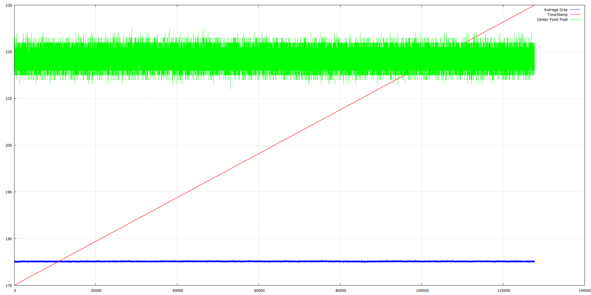

# vimba_csharp_save_image_to_disk
Save freerun images into ssd disk for verification or other algorithms processing.  
连续保存相机拍摄的所有图片到电脑硬盘，以备后续分析处理。  
另外也可以用来排除相机拍摄的图像是否正常，等。  

## 相机设置
* 自由采集模式  
* mono8 或者 RGB8Packed 图像格式  

## 自由采集并存储到电脑硬盘
a. 设置存储目录并找钩  
b. 打开相机  
c. 开始采集  

## 软件触发并存储到电脑硬盘
a. 设置存储目录并找钩  
b. 打开相机  
c. 设置软件触发及其循环周期，例如1000ms  
d. 开始采集  

# Show data in Plot from result.csv


## Average Gray vs TimeStamp vs Center Pixel

```

set yrange [100:250]
set ytics nomirror 
set autoscale xy
plot "result.csv" every ::2 u 2:6 w l title "Average Gray" lc "blue" axis x1y1, "result.csv" every ::2 u 2:3 w l title "TimeStamp" lc "red" axis x1y2, "result.csv" every ::2 u 2:6 w l title "Average Gray" lc "green" axis x1y1, 
set grid 
set autoscale
replot 

plot "result.csv" every ::2 u 2:6 w l title "Average Gray" lc "blue" axis x1y1, "result.csv" every ::2 u 2:3 w l title "TimeStamp" lc "red" axis x1y2, "result.csv" every ::2 u 2:7 w l title "Center Point Pixel" lc "green" axis x1y1,   


```


## Center pixel value of image

```

plot "result.csv" every ::2 u 2:6 w l title "Average Gray" lc "blue" axis x1y1, 


plot "result.csv" every ::2 u 2:7 w l title "Center Point Pixel" lc "green" axis x1y1, 


plot "result.csv" every ::2 u 2:6 w l title "Average Gray" lc "blue" axis x1y1, "result.csv" every ::2 u 2:7 w l title "Center Point Pixel" lc "green" axis x1y1, 


```

## Application: Gray Value of each saved images  



